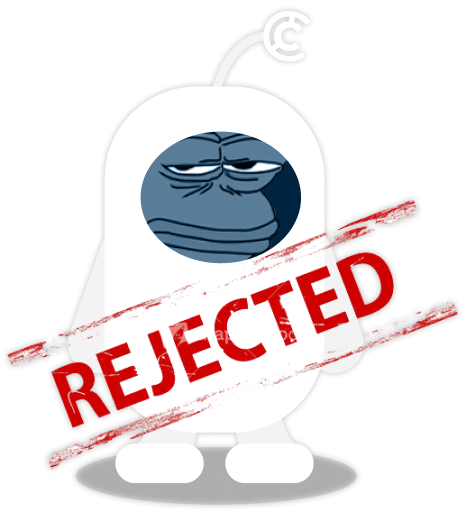

# Compendia Core - True Block Weight API

<p align="center">
  
</p>

[travis-image]: https://api.travis-ci.org/nestjs/nest.svg?branch=master
[travis-url]: https://travis-ci.org/nestjs/nest
[linux-image]: https://img.shields.io/travis/nestjs/nest/master.svg?label=linux
[linux-url]: https://travis-ci.org/nestjs/nest
  
  <p align="center">True Block Weight API server, utilizing the TBW Core plugin!<p align="center">

[](https://opensource.org/licenses/MIT)

## Installation

```bash
$ npm install
```

## Running the app

```bash
# development
$ npm run start

# watch mode
$ npm run start:dev

# production mode
$ npm run start:prod
```

## Test

```bash
# unit tests
$ npm run test

# e2e tests
$ npm run test:e2e

# test coverage
$ npm run test:cov
```

## Security

If you discover a security vulnerability within this package, please send an e-mail to hello@bindie.io. All security vulnerabilities will be promptly addressed.

## Credits

- [Bindie Dev](https://t.me/BindieDev)
  - [Bindie Website](https://bindie.io/)
  - [Bindie Telegram stake bot](https://t.me/CompendiaStakes)
  - [Bindie Twitter stake bot](https://twitter.com/BindieBot)

## Support

POGGERS

## License

[MIT](LICENSE) © [RoboValidators](https://bindie.io/)
